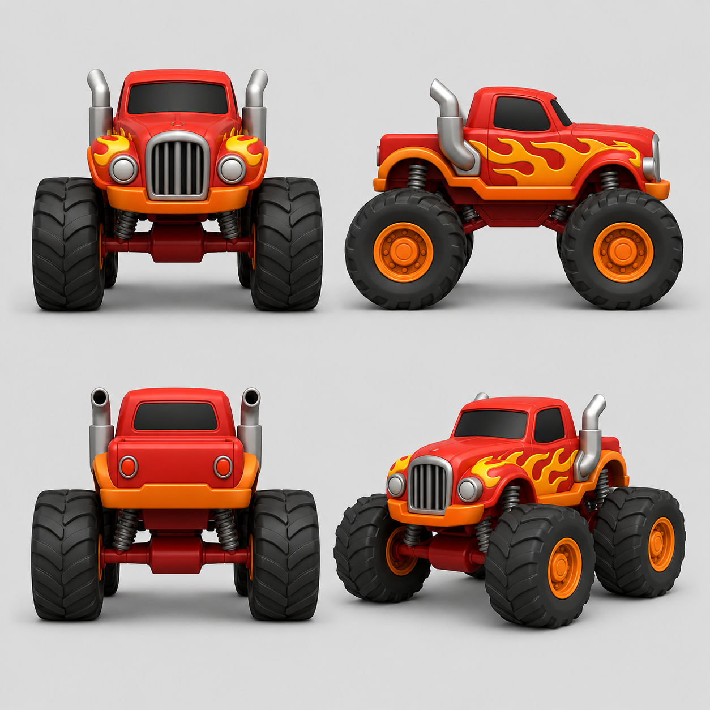
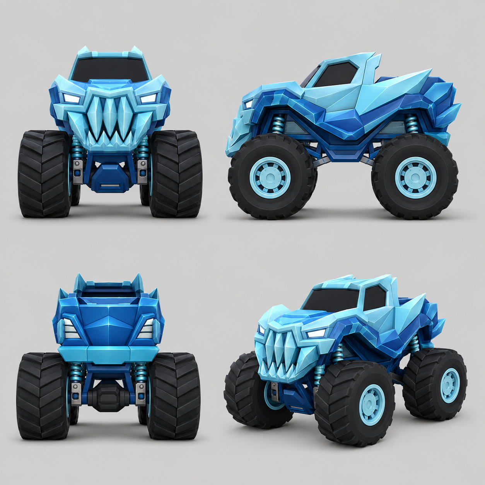
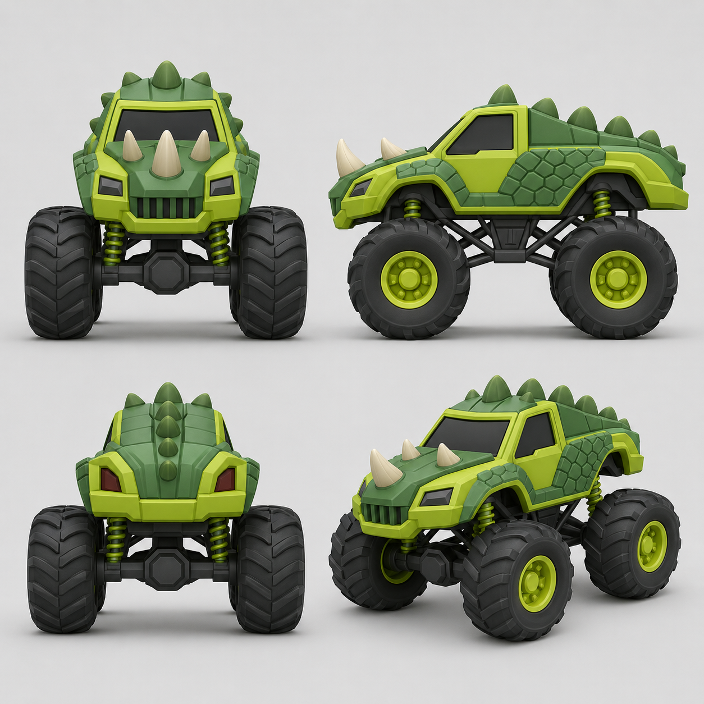
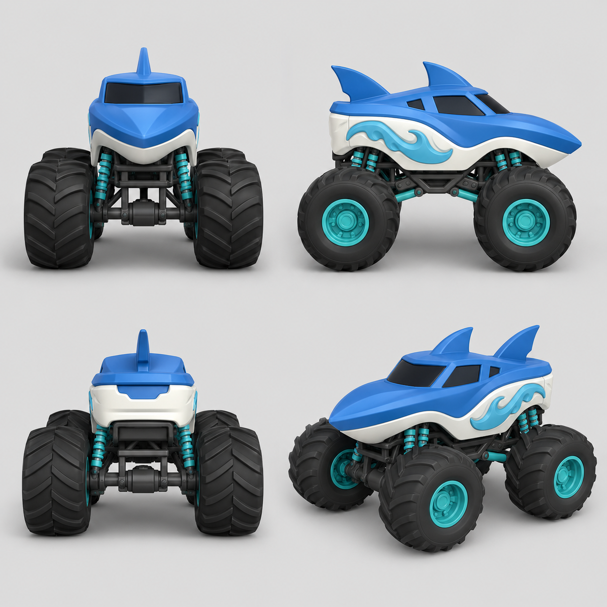
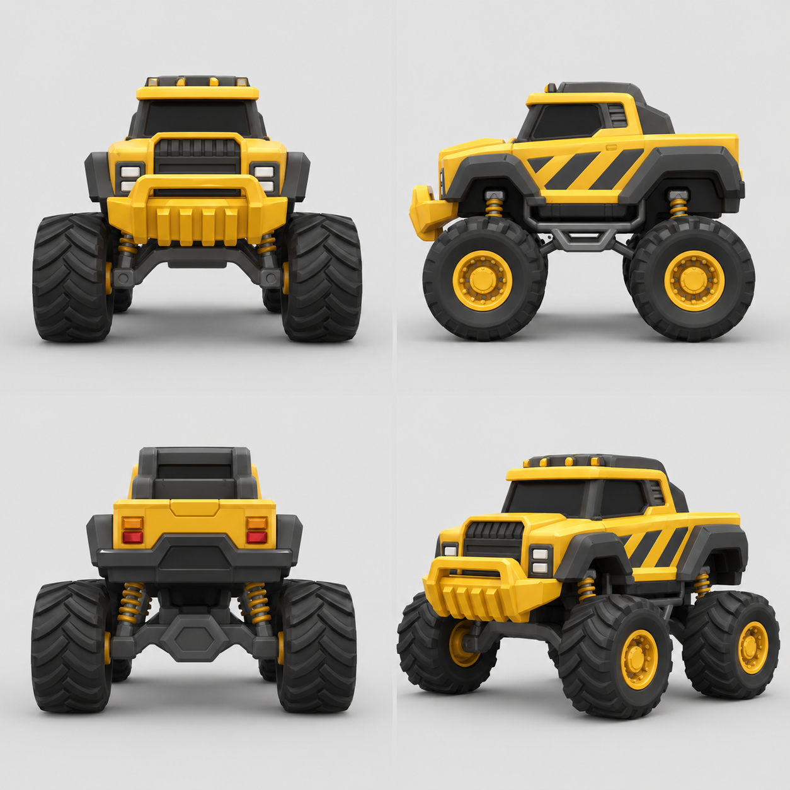
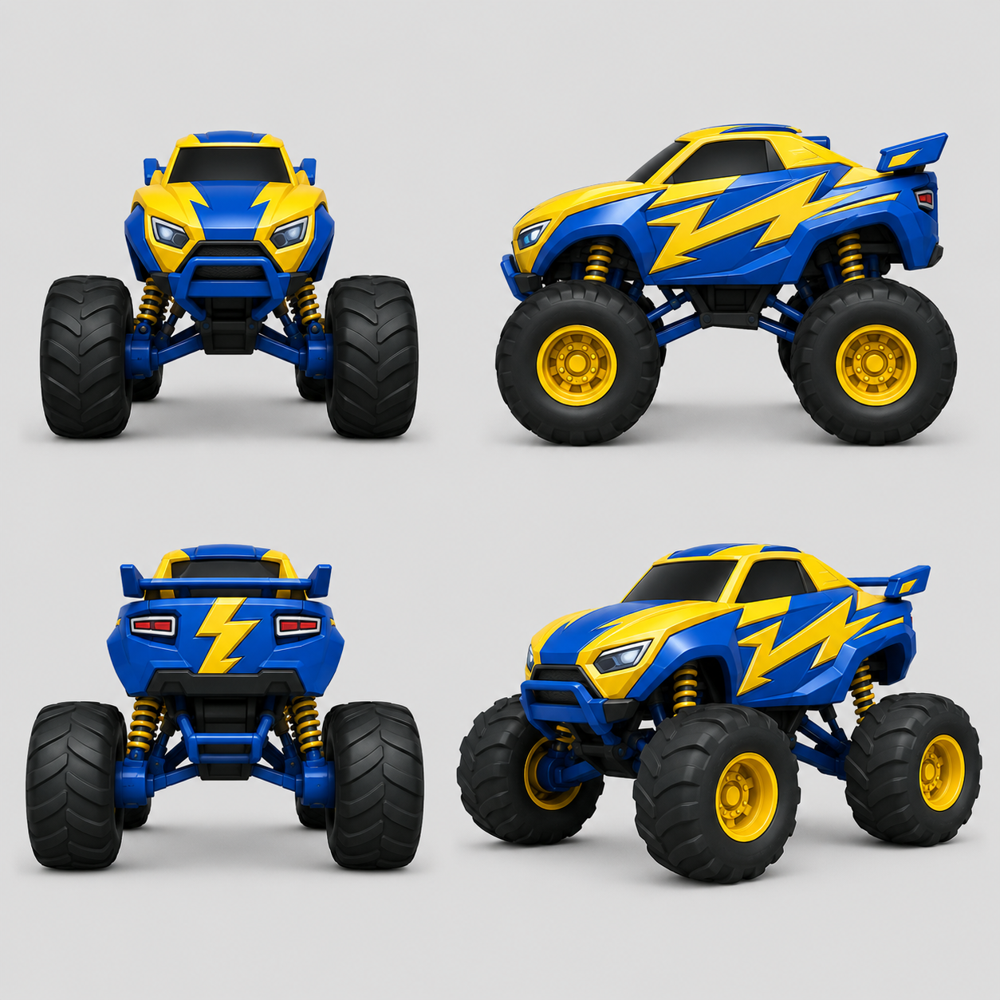
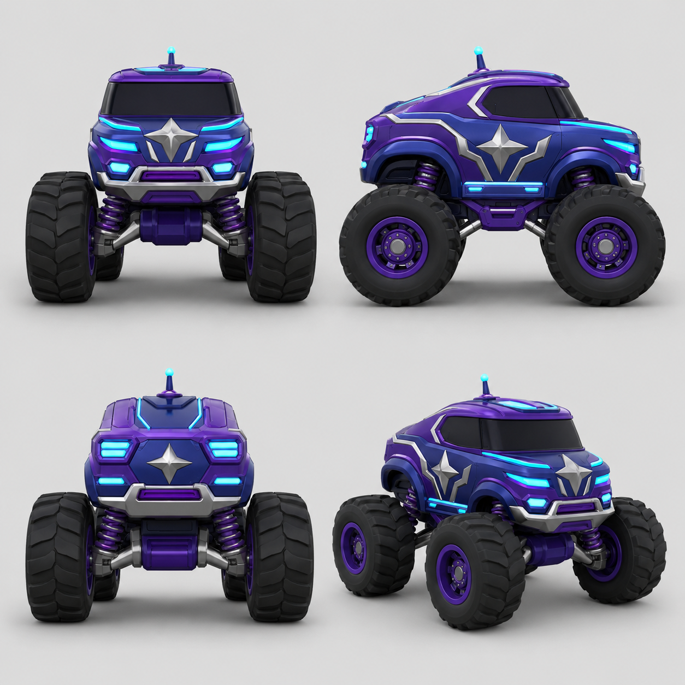
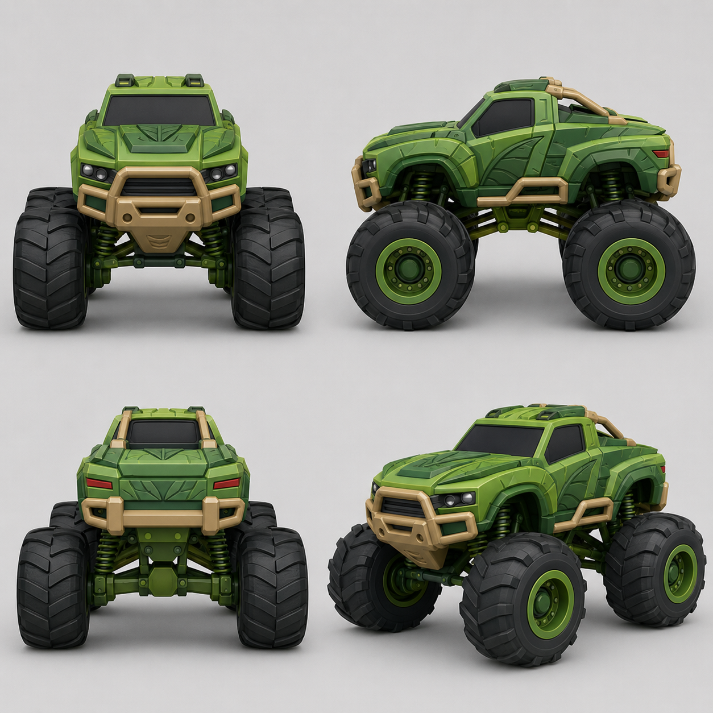
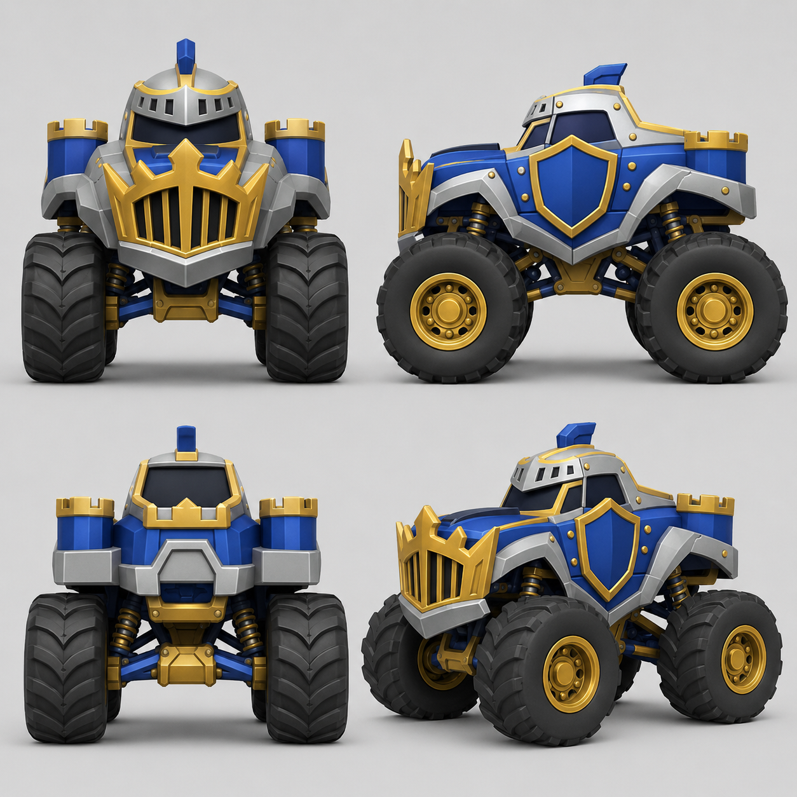
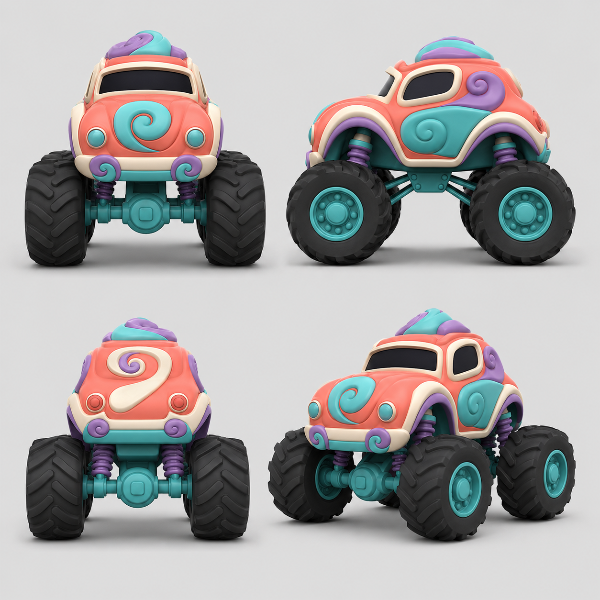

# Version 2.0 — Truck Artwork References

Ten concept sheets supplied by Michael on 4 September 2026. These files are reference images, not 3D models or gameplay captures. Original files are preserved in Downloads.

## Modeling approach

Start with the red flame pickup. Build a reusable chassis, wheel and suspension assembly, then author distinct bodies and decorations around compatible attachment points. Match the overall silhouette and materials first. Resolve differences between the illustrated views into one consistent model; these are perspective concept views, not dimensioned engineering drawings.

A completed truck must have independent wheel steering, spin and suspension travel, configurable body paint, and appropriate collision shapes. A static import alone does not count as integrated artwork.

## Reference inventory

### Red flame pickup

Roster mapping: El Toro Loco / classic.

Rounded cab and fenders; chrome grille and exhausts; flame paint.

### Blue ice truck

Roster mapping: Ice Freeze / dino (legacy internal identifier).

Faceted icy body; pointed grille; pale blue accents.

### Green dinosaur truck

Roster mapping: Distinct concept; no unambiguous existing roster match.

Horned hood; raised scale plates; dorsal spikes. Keep separate from the blue ice truck.

### Blue shark truck

Roster mapping: Sharkbite / shark.

Shaped snout; dorsal and tail fins; white belly and wave trim.

### Yellow construction truck

Roster mapping: Digger Dan / digger.

Heavy bumper; hazard stripes; squared cab and work lights.

### Blue and yellow lightning truck

Roster mapping: Thunder Volt / volt (provisional visual match).

Bolt panels; sport body and rear spoiler. Existing code used a different yellow/black visual description.

### Purple star truck

Roster mapping: Rocket Rumble / rocket.

Star emblems; cyan light strips; rounded futuristic body.

### Green jungle truck

Roster mapping: Jungle Crusher / jungle.

Leaf-pattern body panels; tan brush bars; roof lights.

### Blue and gold knight truck

Roster mapping: Sir Smash-a-Lot / knight.

Helmet cab; shield doors; crenellated rear towers.

### Coral candy truck

Roster mapping: Candy Crush / candy.

Curved beetle body; raised swirls; cream trim and teal chassis.

## Roster coverage

These sheets cover eight clear matches to existing truck identities, one provisional lightning-truck match, and one additional dinosaur concept. Mega Magnet, Astro Smash, and Drago from the existing twelve-truck roster do not have corresponding sheets in this supplied set. Keep those identities on the roadmap; do not silently replace them with other designs.

## First-truck acceptance

- Recognizable silhouette and color treatment compared with the red flame reference.
- Separate correctly centered wheels with visible steering, rotation, and suspension movement.
- Paint customization preserves trim, glass, tires, and flame graphics.
- Appropriate real-world scale and simplified collision shapes.
- Visual inspection in the gameplay camera while turning, jumping, and landing.
- Performance measured on the target iPad before claiming device readiness.
